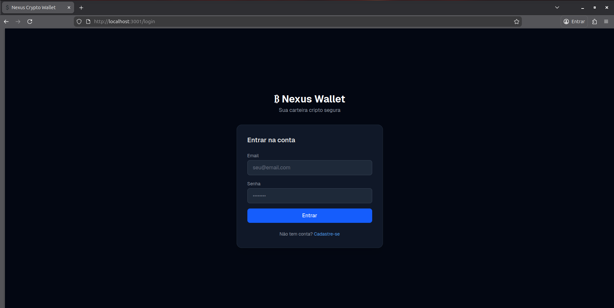
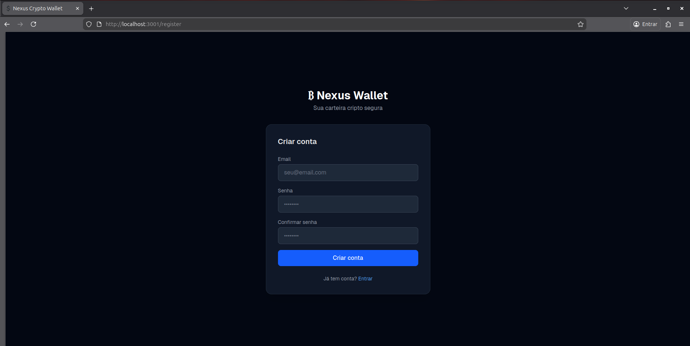
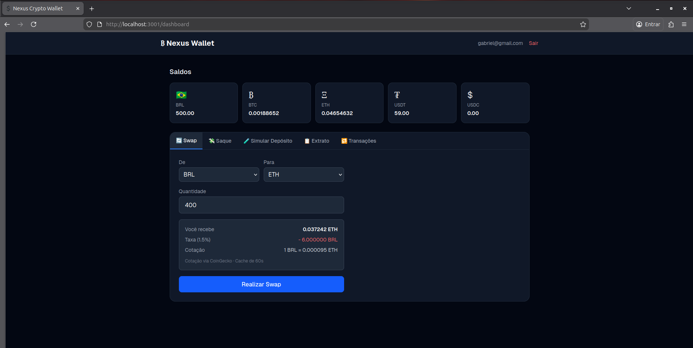
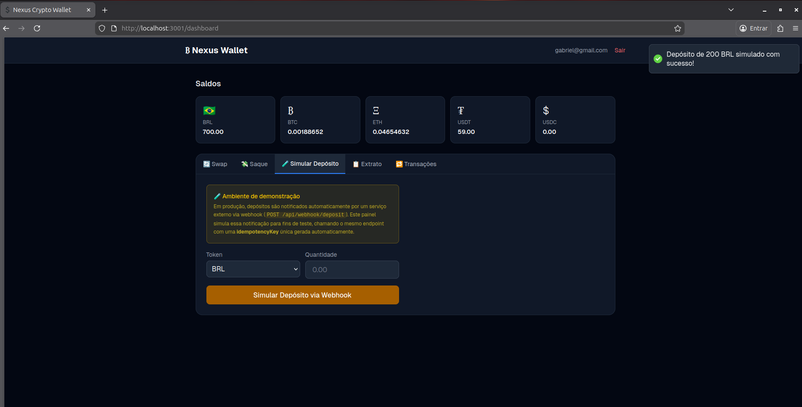
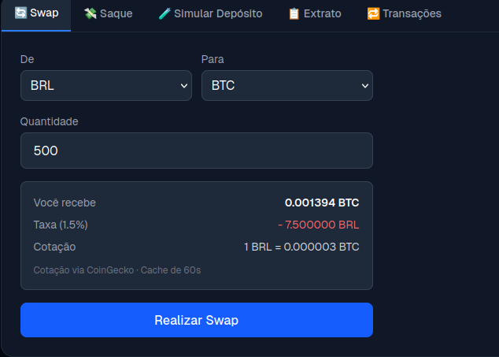
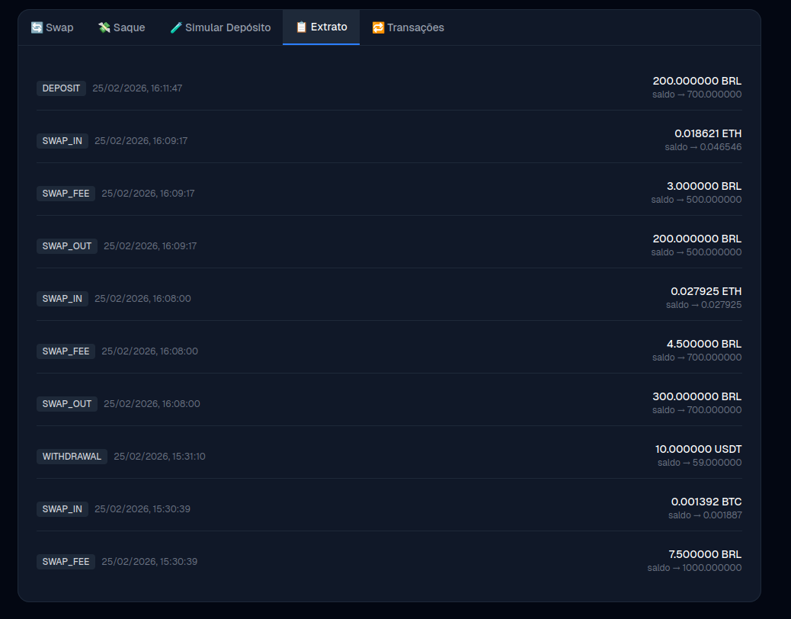
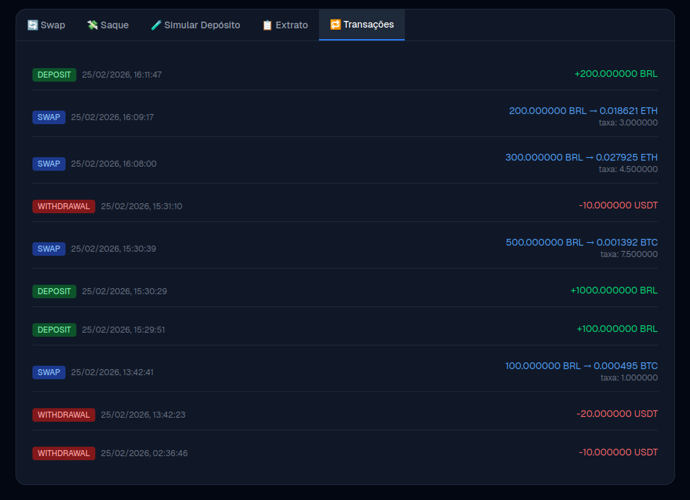
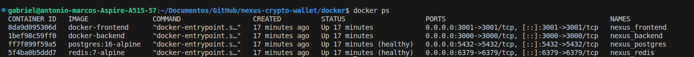

# Nexus Crypto Wallet — Backend API

> **O projeto está no ar.** Você pode acessar e testar tudo em funcionamento em:
> **http://187.77.59.231** *(disponível por aproximadamente 1 mês)*
>
> — Front-end: http://187.77.59.231:3001  
> — API: http://187.77.59.231:3000

---

Implementação do teste técnico para a vaga de Desenvolvedor Backend na Nexus. O projeto consiste em uma API REST de carteira cripto simplificada, com modelagem de dados auditável via ledger, autenticação JWT, operações de depósito, swap e saque, e listagens paginadas.

Além dos requisitos obrigatórios, foram implementados todos os diferenciais opcionais: cache de cotações com Redis, front-end em React consumindo a API e execução completa via Docker Compose.

---

## Stack

**Obrigatória**
- Node.js + TypeScript
- PostgreSQL
- Git

**Diferenciais implementados**
- Redis — cache de cotações
- React — front-end integrado
- Docker / Docker Compose — ambiente completo containerizado
- Deploy funcional em servidor próprio

---

## Funcionalidades

### Autenticação

Cadastro com e-mail e senha, login retornando access token e refresh token (JWT), e middleware protegendo as rotas autenticadas.




### Carteira e saldos

Ao se cadastrar, o usuário recebe uma carteira com saldo zero. A carteira suporta BRL, BTC e ETH. Os saldos são armazenados via modelo de ledger e são sempre auditáveis.



### Depósito via webhook

Endpoint `POST /webhooks/deposit` simulando notificação de serviço externo. Valida `idempotencyKey` para evitar crédito duplicado, credita o token correto e retorna erro caso o usuário ou token não existam.

Payload: `{ userId, token, amount, idempotencyKey }`



### Swap — cotação e execução

A cotação utiliza a API pública da CoinGecko para trazer valores reais, aplica uma taxa fixa de 1,5% e retorna a quantidade de destino, a taxa cobrada e a cotação utilizada. As cotações são cacheadas no Redis com TTL curto para reduzir chamadas externas.

Na execução, o sistema valida o saldo (incluindo taxa), debita o token de origem, credita o destino e registra a transação com todas as movimentações correspondentes.



### Saque

Valida saldo suficiente, debita o token solicitado e registra a transação e a movimentação no ledger. A transferência em si é mock, conforme especificado no teste.

### Ledger — extrato de movimentações

Toda alteração de saldo gera um registro no ledger com tipo, token, valor, saldo anterior, saldo novo e data/hora. O saldo pode ser reconstruído integralmente a partir das movimentações.

Tipos registrados: `DEPOSIT`, `SWAP_IN`, `SWAP_OUT`, `SWAP_FEE`, `WITHDRAWAL`.



### Histórico de transações

Listagem paginada das transações do usuário com tipo (`DEPOSIT`, `SWAP`, `WITHDRAWAL`), tokens envolvidos, valores, taxa quando aplicável e data/hora.



### Ambiente em execução



---

## Deploy

O projeto está rodando em servidor dedicado e pode ser acessado diretamente:

- Front-end: **http://187.77.59.231:3001**
- API: **http://187.77.59.231:3000**

O ambiente ficará disponível por aproximadamente 1 mês a partir da data de entrega.

---

## Como rodar localmente

**Pré-requisito:** Docker e Docker Compose instalados.

```bash
# 1. Clone o repositório
git clone https://github.com/GabrielG71/nexus-crypto-wallet
cd nexus-crypto-wallet

# 2. Suba os containers
docker compose up -d --build

# 3. Acesse
# Front-end: http://localhost:3001
# API:       http://localhost:3000
```

```bash
# Logs (opcional)
docker compose logs -f

# Parar o ambiente
docker compose down
```

---

## Decisões técnicas

### Ledger como fonte de verdade

Toda operação que altera saldo escreve movimentações no ledger com saldo anterior e saldo novo. Isso torna o sistema auditável por completo: o estado atual pode ser reconstruído a partir do histórico, e qualquer inconsistência em swaps ou taxas fica rastreável. A abordagem foi escolhida por reduzir riscos de inconsistência e facilitar debugging de casos de borda.

### Idempotência no depósito

O endpoint de webhook valida `idempotencyKey` antes de processar qualquer crédito. Isso reflete um cenário real comum em integrações com serviços externos, onde o mesmo evento pode ser reenviado por falhas de rede ou retentativas automáticas.

### Cotações via CoinGecko + cache Redis

A cotação usa a API pública da CoinGecko para trazer valores reais no momento do swap. Como diferencial, as respostas são cacheadas no Redis com um TTL curto, o que reduz a dependência da API externa, melhora a performance em rajadas de requisições e torna o sistema mais resiliente a instabilidades.

### Docker para padronizar o ambiente

O ambiente completo — backend, frontend, PostgreSQL e Redis — sobe via `docker compose up` com um único comando. Isso elimina variações de configuração local e garante que a avaliação ocorra no mesmo ambiente que foi desenvolvido.

---

## Estrutura do banco de dados

A modelagem é centrada em cinco entidades principais:

- **User** — credenciais e identificação do usuário
- **Wallet** — carteira vinculada ao usuário (1:1)
- **LedgerEntry** — registro imutável de cada alteração de saldo, com tipo, token, valor, saldo anterior e saldo novo
- **Transaction** — agrupador lógico das operações (depósito, swap, saque), referenciando as movimentações geradas
- **IdempotencyKey** — controle de duplicidade para o endpoint de depósito via webhook

A consistência dos saldos é garantida pelo registro de movimentações em cada operação, formando um histórico completo e auditável.

---

## Autor

Gabriel Gonçalves
